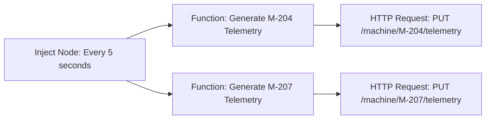

# NemoClaw Manufacturing Decision Claw Demo

This project simulates the REST APIs for an OpenClaw manufacturing decision demo. It provides data services and a dashboard for the OpenClaw decision and policy claws (running inside NemoClaw) to interact with via HTTP tools.

## Project Overview

The system consists of:
- A FastAPI application deployed on Google Cloud Run (or locally)
- SQLite database (`data/demo.db`) seeded on startup
- RESTful endpoints under `/api/v1/`
- A dashboard served at `GET /` (direct file read, no Jinja2)
- No authentication (demo only)

## Three Scenarios

The demo always includes three scenarios in the database:
- **A**: M-204 anomaly, HIGH priority order, alternate M-207 available
- **B**: M-204 anomaly, HIGH priority order, NO alternate machine
- **C**: M-204 anomaly, LOW priority order, alternate M-207 available

## Architecture


*Typical flow:*
1. Node-RED (or similar) simulates telemetry data for machines
2. Telemetry updates are sent to `/api/v1/machine/{id}/telemetry`
3. If vibration > 80% and no pending event exists, an anomaly event is created
4. The OpenClaw decision claw polls for pending events and processes them
5. The decision claw calls execution endpoints (reschedule, ticket, notify)
6. The policy claw logs decisions and execution results
7. The dashboard updates in real-time via polling

## Node-RED Telemetry Simulator

To simulate realistic telemetry data, a Node-RED flow is provided in `nodered/flow.json`. This flow:
- Generates random telemetry data for machines M-204 and M-207 every 5 seconds
- Sends PUT requests to update telemetry via the API
- For M-204, vibration values can exceed 80% to trigger anomaly detection
- For M-207 (alternate), vibration is kept below 80% to avoid false anomalies

### Flow Diagram



### Flow Configuration

The flow consists of:
- **Inject Nodes**: Trigger every 5 seconds (configurable)
- **Function Nodes**: Generate telemetry payloads:
  - *M-204*: Vibration 0-100%, temperature 60-120, pressure 20-50, etc.
  - *M-207*: Vibration 0-79% (to avoid triggering anomalies), other fields similar
- **HTTP Request Nodes**:
  - Method: PUT
  - URL: `http://localhost:8080/api/v1/machine/M-{id}/telemetry`
  - Headers: `Content-Type: application/json`

### Importing the Flow

1. Install Node-RED: `npm install -g node-red`
2. Start Node-RED: `node-red`
3. Open `http://localhost:1880` in your browser
4. Import the flow:
   - Menu → Import → File
   - Select `nodered/flow.json` from this repository
   - Click Import
5. Deploy the flow (click the red deploy button)

### Telemetry Data Format

Each telemetry update includes:
```json
{
  "vibration_percentile": 85,
  "temperature": 95,
  "pressure": 35,
  "operating_hours": 2500,
  "last_maintenance_days_ago": 5,
  "bearing_wear": "medium",
  "failure_probability": 0.7
}
```

Note: Only fields present in the request are updated (others remain unchanged).

## How to Run Locally

### Prerequisites
- Python 3.11+
- Node.js (for Node-RED telemetry simulator, optional)
- Git

### Installation
```bash
# Clone the repository
git clone https://github.com/agsinghmac/NemoClaw-Mfg-Claw.git
cd NemoClaw-Mfg-Claw

# Install Python dependencies
pip install -r requirements.txt

# Install Node-RED (optional, for telemetry simulation)
npm install -g node-red
```

### Running the Application
```bash
# Start the FastAPI server
uvicorn main:app --reload --port 8080

# In another terminal, start Node-RED for telemetry (optional)
node-red
# Then import and deploy nodered/flow.json as described above
```

### Running Without Node-RED
You can manually trigger scenarios using the provided endpoints:
```bash
# Trigger Scenario A
curl -X POST http://localhost:8080/api/v1/trigger/A

# Trigger Scenario B
curl -X POST http://localhost:8080/api/v1/trigger/B

# Trigger Scenario C
curl -X POST http://localhost:8080/api/v1/trigger/C

# Reset demo (development only)
curl -X POST http://localhost:8080/api/v1/dev/reset
```

## How to Deploy to Google Cloud Run

### Prerequisites
- Google Cloud Project
- gcloud CLI installed and authenticated
- Docker installed

### Deployment
```bash
# Make sure you're in the project directory
./deploy.sh YOUR_GCP_PROJECT_ID
```

The deploy script will:
1. Build the Docker image
2. Push to Google Container Registry
3. Deploy to Cloud Run on port 8080

## Endpoints Reference

### Health Check
- `GET /health` - Returns database status and table counts

### Machine Telemetry
- `GET /api/v1/machine/{id}` - Get machine details
- `PUT /api/v1/machine/{id}/telemetry` - Update telemetry fields

### Orders
- `GET /api/v1/orders/active/{machine_id}` - Get active order for machine

### Resources
- `GET /api/v1/machines/available` - List available machines
- `GET /api/v1/machines/available/{machine_id}` - Get specific available machine

### Maintenance
- `GET /api/v1/maintenance/{machine_id}/summary` - Get maintenance summary

### Execution
- `POST /api/v1/execute/reschedule` - Reschedule order
- `POST /api/v1/execute/ticket` - Create maintenance ticket
- `POST /api/v1/execute/notify` - Send notification

### Events
- `GET /api/v1/events/pending` - Get pending anomaly events
- `POST /api/v1/events/{id}/acknowledge` - Acknowledge event

### Decision Log
- `GET /api/v1/log` - Get recent decisions
- `POST /api/v1/log` - Log a decision

### Development Only
- `POST /api/v1/dev/reset` - Reset to seed state
- `POST /api/v1/trigger/{scenario_id}` - Manually trigger scenario

## Database Schema

The SQLite database contains five tables:
1. `machines` - Machine telemetry and status
2. `orders` - Production orders
3. `maintenance_history` - Maintenance records
4. `decision_logs` - Decision audit trail
5. `events` - Anomaly events

Seed data is populated in `seed.py` using `INSERT OR IGNORE` for safe restarts.

## Dashboard

The dashboard provides real-time visualization:
- **Top Bar**: System title, live M-204 telemetry, scenario triggers, reset button (dev)
- **Left Panel**: Machine state, active order, alternate machine status
- **Center Panel**: Selected decision, options evaluated, reasoning
- **Right Panel**: Policy audit trace, execution log
- **Auto-refresh**: Polls every 5 seconds for updates
- **Anomaly Banner**: Appears when pending events exist

## Development Notes

- All Pydantic models are defined in `models.py`
- Database access is strictly through `get_db()` from `database.py`
- Seed data uses `INSERT OR IGNORE` to prevent duplicates on restart
- Error responses follow FastAPI default: `{"detail": "message"}`
- Datetime fields are stored as ISO 8601 strings in SQLite

## License

This project is for demonstration purposes only.